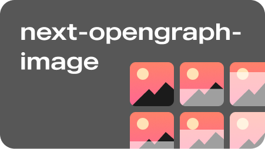

# Next Opengraph Image

Generate opengraph images (og:image) at build using puppeteer.

## Features

- Speed. It uses puppeteer to render pages, but only on instace meaning there is only one cold start. On an M1, 100 pages are captured in 14s.
- Multiple layouts. Pages can specify different layouts.
- Easy setup. Set up is easy and does not require you to touch any render logic.
- Pass any data. Title and meta description is passed to the layout pages by default, but you can include any data you want.

## Usage

### Installation

Use npm or yarn

```bash
npm install next-opengraph-image
yarn add next-opengraph-image
```

Add this to your scripts in package.json

```json
"postbuild": "next-opengraph-image",
```

### Setup on pages

Import the `useOgImage` hook in every page

```jsx
// Step 1
import { useOgImage } from "next-opengraph-image";

export default function Home() {
  // Step 2
  const ogImage = useOgImage();

  return (
    <div>
      <Head>
        <title>...</title>
        <meta name="description" content="..." />
        <link rel="icon" href="/favicon.ico" />

        // Step 3
        <meta {...ogImage} />
      </Head>
      ...
  )
}
```

By default, the html title and meta description tag will be picked up and included and sent as data to the layout pages. If you want to include custom data, use the hook like this.

```jsx
const ogImage = useOgImage({
  data: {
    /* anything here */
  },
});
```

You can also specify a custom layout like this.

```jsx
const ogImage = useOgImage({
  layout: "blogpost",
});
```

### Layout files

Create a folder called `_ogimage` in your `/pages` folder. Then create a file called `default.js` there.

An example of a layout file looks like this. Notice the position and size.

```jsx
export default function Default() {
  const { title, description } = useData({
    placeholder: {
      title: "Placeholder title",
      description: "Placeholder description",
    },
  });

  return (
    <div
      style={{
        padding: "100px",
        background: "#ededed",
        width: "1200px",
        height: "630px",
        position: "fixed",
        top: "0",
        left: "0",
      }}
    >
      

      <div>
        <h1 style={{ fontSize: "5em" }}>{title}</h1>
        <h2 style={{ fontSize: "2em" }}>{description}</h2>
      </div>
    </div>
  );
}
```

The placeholder is used in development and should match what is returned from the hook. In production it returns whaterver data was extracted from the actual or the useOgImage hook data.

## Example

There is an example showcasing usage [here](/example)

## License

[MIT](LICENSE)

## Contributing

Contributions are always welcome!

See [CONTRIBUTING.md](CONTRIBUTING.md) for ways to get started.

## Feedback

If you have any feedback, please [create an issue](https://github.com/alvarlagerlof/next-opengraph-image/issues/new) reach me on [twitter](https://twitter.com/alvarlagerlof).

```

```
