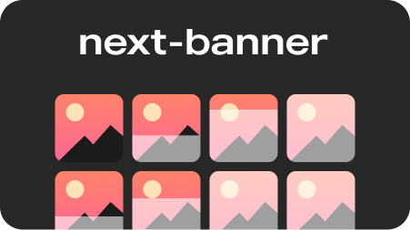

# Next Banner

Generate opengraph images (og:image) at build using Puppeteer.

## What is an opengraph image?

Open Graph is a protocol for structured metadata for websites. Part of that is a specification for preview images referred to as "og:image". When using that, your website gets a nice preview in social media and messaging apps. For an example, check out [ogimage.gallery](https://www.ogimage.gallery/).

## Why this library?

You might think you can design an images in Figma. This is entirely doable, but quickly becomes tedious if you have a lot of pages (like blog posts) or want to change the design. Generating images is much more effective.

Most currently existing solutions run on-demand either in a serverless function or in a service. This is wasteful and could be expensive if demand is high. For example, cold starting puppeteer to take a screenshot of the page can take 8s per visitor. To counteract this, a CDN can be used, which further increases the amount of things needing setup.

With next-banner, none of that is needed. In true Jamstack fashion, this library generates images at build, using existing infrastructure that you already have.

## Features

- **Speed.** It uses Puppeteer to render pages, but only on instance, meaning there is only one cold start. On an M1, 100 pages are rendered and captured in 18s.
- **Simple setup.** Does not require you to touch puppeteer, CDNs, or serverless functions.
- **Render using React.** Your images are captured pages that you code in React just like you are used to. No SVGs or special template languages.
- **Multuple layouts.** You could have one layout for a start page and another for blog posts.
- **Pass any data.** Page title and meta description is passed to the layout pages by default, but you can include any data in any structure you want.

## Usage

### Installation

Use npm or yarn

```bash
npm install next-banner
yarn add next-banner
```

Add this to your scripts in package.json

```json
"postbuild": "next-banner",
```

### Configuration

Edit `next.config.js` to wrap wrap the config with `withNextBanner`. The domain property is needed for some social media sites to render the images.


```js
const { withNextBanner } = require("next-banner");

module.exports = withNextBanner({
  nextBanner: {
    domain: "example.com",
  },
  // ... normal Next.js config here.
});

```

### Layout files

Create a folder called `next-banner-layouts/` in your `pages/` folder. Then create a file called `default.js` there and add the following code:

```js
import { Template } from "next-banner";

export default Template;
```


### Custom layotus

To use a custom layout you first need to declare that a page should render another layout using hte `setBannerData` hook.


pages/post.jsx
```jsx
import { setBannerData } from "next-banner";

function PostPage() {
  setBannerData({
    layout: "post" // This is the name of the layout file.
  })

  return (
    ...
  )
}

```

Then you need a layout file. Notice the default (`=`) parameters in the desctructuring. This helps during local development. In production, the hook will return the real data. But locally, data has not been extracted from the pages.

pages/next-banner-layouts/post.jsx
```jsx
export default function PostLayout() {
  const {
    title = "Placeholder title",
    description = "Placeholder description"
  } = useBannerData();

  return (
    <ScreenshotCanvas>
      <div
        style={{
          display: "flex",
          flexDirection: "row",
          alignItems: "center",
          gap: "20px",
          marginBlockEnd: "30px",
        }}
      >
        

        <div>
          <h1 style={{ fontSize: "5em" }}>{title}</h1>
          <h2 style={{ fontSize: "2em" }}>{description}</h2>
        </div>
    </div>
  </ScreenshotCanvas>
  );
}
```

### Custom data

If you want to add any extra data besides the meta title and description, you can do so with a the `setBannerData` on the normal (non-layout) page.

```jsx
import { setBannerData } from "next-banner";

function ImagePage() {
  setBannerData({
    custom: {
      image: "https://example.com/image.jpg"
    }
  })
}

```

It can then be accessed in layout files using `useBannerData`.

```jsx
import { useBannerData } from "next-banner"

function ImageLayout() {
  const {
    custom: {
      image
    }
  } = useBannerData()

  return (
    ... // Your layout here.
  )
}
```

## Example

There is an example showcasing usage [here](/example)

## License

[MIT](LICENSE)

## Contributing

Contributions are always welcome!

See [CONTRIBUTING.md](CONTRIBUTING.md) for ways to get started.

## Feedback

If you have any feedback, please [create an issue](https://github.com/alvarlagerlof/next-banner/issues/new) reach me on [twitter](https://twitter.com/alvarlagerlof).
